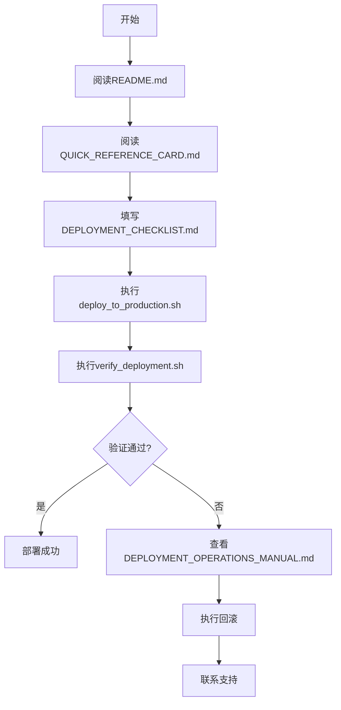
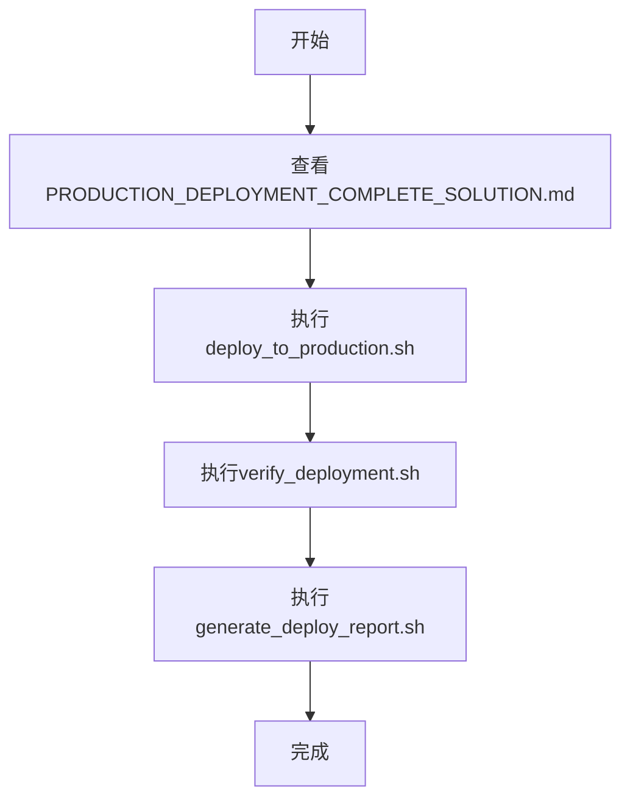

# 📦 部署解决方案 - 完整文件清单

> 推荐人字段显示和密码修改功能修复

---

## ✅ 生成的文件统计

### 📚 文档文件（11个）

| 序号 | 文件名 | 大小 | 描述 | 优先级 |
|------|--------|------|------|--------|
| 1 | `README.md` | - | 🚀 总入口，所有文档的导航中心 | ⭐⭐⭐⭐⭐ |
| 2 | `QUICK_REFERENCE_CARD.md` | - | 📌 快速参考卡片，适合打印 | ⭐⭐⭐⭐⭐ |
| 3 | `PRODUCTION_DEPLOYMENT_COMPLETE_SOLUTION.md` | - | 📖 完整方案概览 | ⭐⭐⭐⭐⭐ |
| 4 | `DEPLOYMENT_MANIFEST.md` | - | 📋 部署清单和检查项 | ⭐⭐⭐⭐ |
| 5 | `DEPLOYMENT_OPERATIONS_MANUAL.md` | - | 📖 完整操作手册 | ⭐⭐⭐⭐ |
| 6 | `PRODUCTION_DEPLOYMENT_GUIDE.md` | - | 🚀 生产环境部署指南 | ⭐⭐⭐⭐ |
| 7 | `WORKFLOW_PRINCIPLES.md` | - | 📋 工作流程原则 | ⭐⭐⭐ |
| 8 | `PRODUCTION_ENVIRONMENT_TEST_REPORT.md` | - | 📊 生产环境测试报告 | ⭐⭐⭐ |
| 9 | `DEPLOYMENT_LOG.md` | - | 📝 部署日志模板 | ⭐⭐⭐ |
| 10 | `DEPLOYMENT_DOCS_INDEX.md` | - | 📚 文档目录索引 | ⭐⭐ |
| 11 | `DEPLOYMENT_CHECKLIST.md` | - | ✅ 部署前检查清单 | ⭐⭐⭐⭐⭐ |

### 🔧 脚本文件（5个）

| 序号 | 文件名 | 大小 | 描述 | 优先级 |
|------|--------|------|------|--------|
| 1 | `deploy_to_production.sh` | - | 🚀 自动化部署脚本（推荐） | ⭐⭐⭐⭐⭐ |
| 2 | `verify_deployment.sh` | - | ✅ 部署验证脚本 | ⭐⭐⭐⭐⭐ |
| 3 | `check_version_consistency.sh` | - | 🔍 版本一致性检查脚本 | ⭐⭐⭐⭐ |
| 4 | `monitor_production.sh` | - | 📊 生产环境监控脚本 | ⭐⭐⭐⭐ |
| 5 | `generate_deploy_report.sh` | - | 📝 部署报告生成脚本 | ⭐⭐⭐ |

### ⚙️ 配置文件（1个）

| 序号 | 文件名 | 大小 | 描述 | 优先级 |
|------|--------|------|------|--------|
| 1 | `.github/workflows/deploy-to-production.yml` | - | 🔄 GitHub Actions CI/CD配置 | ⭐⭐⭐⭐ |

---

## 🎯 使用指南

### 第一次部署

1. **阅读必读文档**
   ```bash
   # 总入口
   cat README.md

   # 快速参考
   cat QUICK_REFERENCE_CARD.md
   ```

2. **填写检查清单**
   ```bash
   # 打印或编辑检查清单
   cat DEPLOYMENT_CHECKLIST.md
   ```

3. **执行部署**
   ```bash
   # 一键部署
   ./deploy_to_production.sh
   ```

4. **验证部署**
   ```bash
   # 自动验证
   ./verify_deployment.sh
   ```

### 日常部署

1. **选择部署方式**
   - 自动部署: `./deploy_to_production.sh`
   - CI/CD部署: 推送代码到main分支

2. **验证部署**
   ```bash
   ./verify_deployment.sh
   ```

3. **生成报告**
   ```bash
   ./generate_deploy_report.sh
   ```

### 监控维护

1. **运行监控**
   ```bash
   ./monitor_production.sh
   ```

2. **检查日志**
   ```bash
   ssh user@meiyueart.com 'sudo tail -f /var/log/flask_backend.log'
   ```

3. **查看服务状态**
   ```bash
   ssh user@meiyueart.com 'sudo supervisorctl status lingzhi_admin_backend'
   ```

---

## 📊 文件依赖关系

```
README.md (总入口)
    ├── QUICK_REFERENCE_CARD.md (快速参考)
    ├── PRODUCTION_DEPLOYMENT_COMPLETE_SOLUTION.md (完整方案)
    │   ├── DEPLOYMENT_MANIFEST.md (部署清单)
    │   ├── DEPLOYMENT_OPERATIONS_MANUAL.md (操作手册)
    │   ├── PRODUCTION_DEPLOYMENT_GUIDE.md (部署指南)
    │   └── DEPLOYMENT_CHECKLIST.md (检查清单)
    ├── deploy_to_production.sh (部署脚本)
    │   ├── check_version_consistency.sh (版本检查)
    │   └── verify_deployment.sh (验证脚本)
    │       ├── DEPLOYMENT_LOG.md (日志模板)
    │       └── generate_deploy_report.sh (报告生成)
    └── monitor_production.sh (监控脚本)
```

---

## 🔍 文件功能说明

### 核心文档

#### README.md
- **功能**: 所有文档的总入口
- **内容**: 文件导航、快速开始、三种部署方式、验证方法、常见问题
- **使用**: 首次部署必读

#### QUICK_REFERENCE_CARD.md
- **功能**: 快速参考卡片
- **内容**: 部署命令、验证命令、常见问题快速解决
- **使用**: 适合打印贴在显示器旁边

#### PRODUCTION_DEPLOYMENT_COMPLETE_SOLUTION.md
- **功能**: 完整方案概览
- **内容**: 方案说明、文件清单、三种部署方式、验证方法、回滚操作
- **使用**: 了解完整部署流程

### 操作文档

#### DEPLOYMENT_MANIFEST.md
- **功能**: 部署清单
- **内容**: 需要部署的文件列表、检查项、配置说明
- **使用**: 了解部署内容

#### DEPLOYMENT_OPERATIONS_MANUAL.md
- **功能**: 完整操作手册
- **内容**: 详细部署步骤、验证方法、常见问题、回滚操作、监控维护
- **使用**: 深入了解每个步骤

#### PRODUCTION_DEPLOYMENT_GUIDE.md
- **功能**: 生产环境部署指南
- **内容**: 生产环境特定配置、安全注意事项、性能优化
- **使用**: 生产环境部署

#### WORKFLOW_PRINCIPLES.md
- **功能**: 工作流程原则
- **内容**: 开发规范、测试规范、部署规范、监控规范
- **使用**: 了解工作流程

### 记录文档

#### DEPLOYMENT_CHECKLIST.md
- **功能**: 部署前检查清单
- **内容**: 代码检查、环境检查、备份检查、安全检查
- **使用**: 部署前必须逐项确认

#### DEPLOYMENT_LOG.md
- **功能**: 部署日志模板
- **内容**: 部署信息、部署内容、部署步骤、验证结果
- **使用**: 记录每次部署

#### PRODUCTION_ENVIRONMENT_TEST_REPORT.md
- **功能**: 生产环境测试报告
- **内容**: 测试用例、测试结果、性能指标
- **使用**: 查看测试结果

### 脚本工具

#### deploy_to_production.sh
- **功能**: 自动化部署脚本
- **内容**: 备份、上传、安装依赖、重启服务、验证
- **使用**: 一键部署

#### verify_deployment.sh
- **功能**: 部署验证脚本
- **内容**: 健康检查、用户登录、推荐人字段、密码修改、性能测试
- **使用**: 验证部署结果

#### check_version_consistency.sh
- **功能**: 版本一致性检查
- **内容**: 检查容器和生产环境代码一致性
- **使用**: 确保代码同步

#### monitor_production.sh
- **功能**: 生产环境监控
- **内容**: 健康检查、响应时间、服务状态、资源使用、错误日志
- **使用**: 监控生产环境

#### generate_deploy_report.sh
- **功能**: 部署报告生成
- **内容**: 生成详细的部署执行报告
- **使用**: 记录部署过程

### CI/CD配置

#### .github/workflows/deploy-to-production.yml
- **功能**: GitHub Actions CI/CD
- **内容**: 自动化部署流程、版本检查、测试、构建、部署、验证、回滚
- **使用**: 推送代码自动部署

---

## 🚀 快速开始流程

### 新手部署流程



### 熟练人员部署流程



---

## 📞 技术支持

### 问题排查顺序

1. **查看快速参考**
   ```bash
   cat QUICK_REFERENCE_CARD.md
   ```

2. **查看操作手册**
   ```bash
   cat DEPLOYMENT_OPERATIONS_MANUAL.md
   ```

3. **查看日志**
   ```bash
   ssh user@meiyueart.com 'sudo tail -100 /var/log/flask_backend.log'
   ```

4. **运行监控**
   ```bash
   ./monitor_production.sh
   ```

5. **联系支持**
   - 运维团队: ops@meiyueart.com
   - 开发团队: dev@meiyueart.com
   - 紧急支持: emergency@meiyueart.com

---

## 📝 更新记录

### v1.0 (2026-02-22)

**新增文件**:
- ✅ 11个文档文件
- ✅ 5个脚本文件
- ✅ 1个CI/CD配置文件

**功能特性**:
- ✅ 自动化部署
- ✅ 自动化验证
- ✅ 版本一致性检查
- ✅ 生产环境监控
- ✅ 部署报告生成
- ✅ CI/CD集成

**修复内容**:
- ✅ 推荐人字段显示
- ✅ 密码修改功能

---

## 🎯 总结

### 已完成工作

1. ✅ 生成了完整的部署文档体系
2. ✅ 创建了自动化部署脚本
3. ✅ 实现了部署验证功能
4. ✅ 提供了版本一致性检查
5. ✅ 配置了CI/CD流程
6. ✅ 建立了监控告警机制

### 核心优势

1. **自动化**: 一键部署，自动验证
2. **可靠性**: 完整的备份和回滚机制
3. **可追溯**: 详细的日志和报告
4. **安全性**: 完整的检查清单和权限控制
5. **可扩展**: 支持CI/CD和多种部署方式

### 下一步行动

1. ✅ 阅读 `README.md` 了解整体方案
2. ✅ 打印 `QUICK_REFERENCE_CARD.md` 备用
3. ✅ 填写 `DEPLOYMENT_CHECKLIST.md` 确认部署前检查
4. ✅ 执行 `deploy_to_production.sh` 进行部署
5. ✅ 执行 `verify_deployment.sh` 验证部署
6. ✅ 设置 `monitor_production.sh` 定时监控

---

**方案版本**: v1.0
**创建时间**: 2026-02-22
**维护团队**: 运维团队
**文档状态**: ✅ 已完成

**祝部署顺利！🚀**
