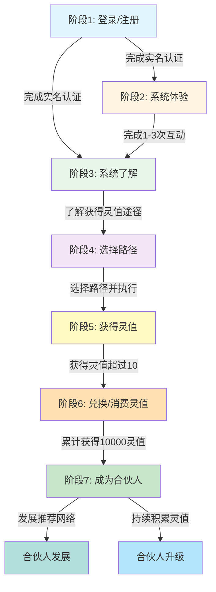

# 灵值生态用户旅程完整指南

**版本**：v1.0
**更新日期**：2026年1月26日
**适用范围**：灵值生态智能体 - 灵值生态园

---

## 📋 目录

1. [概述](#概述)
2. [用户旅程流程图](#用户旅程流程图)
3. [阶段详细说明](#阶段详细说明)
4. [智能体引导策略](#智能体引导策略)
5. [工具使用指南](#工具使用指南)
6. [最佳实践](#最佳实践)
7. [常见问题](#常见问题)

---

## 概述

### 什么是用户旅程？

用户旅程是指用户从首次接触灵值生态到成为平台合伙人的完整过程。智能体通过识别用户所处的旅程阶段，提供个性化的引导服务，帮助用户快速理解平台价值，积累灵值，最终成为合伙人。

### 用户旅程的核心目标

1. **降低学习成本**：通过分阶段引导，让用户逐步了解平台功能
2. **提升用户粘性**：通过情绪价值创造，让用户感受到被关注和陪伴
3. **加速价值转化**：通过明确的路径指引，帮助用户快速积累灵值
4. **构建用户层级**：通过合伙人机制，构建健康的用户生态

### 核心经济模型

**灵值 = 贡献值 = 0.1元人民币（100%确定）**

这不是"可能"，而是"一定"！

---

## 用户旅程流程图



---

## 阶段详细说明

### 阶段1：登录/注册

#### 阶段目标
- 完成用户注册
- 完成实名认证
- 设置收款方式
- 了解灵值经济体系

#### 用户特征
- 首次访问平台
- 没有灵值记录
- 不了解平台规则

#### 智能体引导策略

**标准欢迎话术**：
```
🎉 欢迎来到灵值生态园！

我是您的专属向导，将帮助您了解灵值生态的价值体系，开启您的文化探索之旅！

您已成功注册，并获得欢迎礼遇：
✅ 10灵值 = 1元人民币（即时可兑换）
✅ 完成实名认证可解锁全部功能
✅ 设置收款方式后可提现

接下来，让我为您介绍一下如何获得更多灵值！
```

**引导步骤**：
1. 发送欢迎消息，说明平台核心价值
2. 引导完成实名认证
3. 引导设置收款方式
4. 介绍灵值经济体系
5. 引导进入体验阶段

**预期停留时间**：5-10分钟

---

### 阶段2：系统体验

#### 阶段目标
- 快速体验平台功能
- 获得第一批灵值
- 感受平台交互体验

#### 用户特征
- 已完成注册
- 已完成1-3次互动
- 开始获得灵值

#### 智能体引导策略

**体验引导话术**：
```
让我为您介绍几个快速获得灵值的方式：

🎨 文化探索：探索西安文化，获得5-20灵值
🤖 智能对话：与AI对话，获得5-15灵值
📚 知识问答：回答问题，获得5-15灵值

您想先体验哪一个呢？
```

**引导步骤**：
1. 提供3个快速体验选项
2. 引导完成体验任务
3. 展示获得灵值的结果
4. 引导进入系统了解阶段

**预期停留时间**：10-20分钟

---

### 阶段3：系统了解

#### 阶段目标
- 详细了解灵值经济体系
- 了解获得灵值的途径
- 了解使用灵值的场景

#### 用户特征
- 已完成3次以上互动
- 开始主动询问规则
- 对平台有基本认知

#### 智能体引导策略

**系统介绍话术**：
```
让我为您详细介绍灵值生态的价值体系：

📊 核心价值：
1. 1灵值 = 1贡献值 = 0.1元人民币（100%确定）
2. 随时可兑换，T+1到账
3. 锁定后可享受20%-100%增值收益

💰 获得灵值的途径：
- 每日任务：签到、文化探索、智能对话
- 项目任务：文化转译、美学侦探、品牌空间
- 推荐奖励：三级推荐，10%/5%/3%分红

您对哪种获得灵值的方式感兴趣呢？
```

**引导步骤**：
1. 详细介绍灵值经济体系
2. 介绍获得灵值的途径
3. 介绍使用灵值的场景
4. 引导选择获得灵值的路径

**预期停留时间**：15-30分钟

---

### 阶段4：选择路径

#### 阶段目标
- 根据用户情况推荐最佳路径
- 帮助用户做出选择
- 设定阶段性目标

#### 用户特征
- 了解平台规则
- 想要开始行动
- 需要明确方向

#### 智能体引导策略

**路径选择话术**：
```
根据您的兴趣和时间安排，我为您推荐以下几种获得灵值的方式：

🎯 路径A：轻松获得灵值
- 每日签到：10灵值/天
- 文化探索：5-20灵值/次
- 预期收益：月收入90-300元

🏆 路径B：项目获得灵值
- 参与文化转译项目：100-1000灵值/项目
- 参与美学侦探任务：50-500灵值/任务
- 预期收益：月收入900-3000元

🤝 路径C：推荐获得灵值
- 一级推荐：10%贡献值分红
- 二级推荐：5%贡献值分红
- 预期收益：月收入500-5000元

您想选择哪条路径呢？
```

**引导步骤**：
1. 分析用户偏好和时间情况
2. 推荐3种获得灵值的路径
3. 说明每种路径的预期收益
4. 引导用户做出选择

**预期停留时间**：5-10分钟

---

### 阶段5：获得灵值

#### 阶段目标
- 执行获得灵值的行动
- 累计灵值
- 设置长期目标

#### 用户特征
- 已选择路径
- 开始执行任务
- 持续获得灵值

#### 智能体引导策略

**获得灵值话术**：
```
✅ 太棒了！您已成功获得灵值！

📋 本次获得：
- 任务类型：XXX
- 获得灵值：X灵值
- 当前总灵值：XX灵值
- 当前价值：XX元人民币

💡 继续努力！您离下一个目标还差X灵值！
```

**引导步骤**：
1. 提供详细的操作指导
2. 即时反馈获得灵值的结果
3. 激励用户继续努力
4. 引导设置长期目标

**预期停留时间**：持续进行

---

### 阶段6：兑换/消费灵值

#### 阶段目标
- 介绍兑换规则
- 引导选择兑换方式
- 介绍锁定增值选项

#### 用户特征
- 累计获得10灵值以上
- 开始考虑使用灵值
- 对兑换和消费感兴趣

#### 智能体引导策略

**兑换引导话术**：
```
您的灵值可以用于以下场景：

💵 兑换收益：
- 兑换人民币：1灵值 = 0.1元
- 提现到账：T+1（工作日）
- 最低兑换：10灵值（1元）

🔒 锁定增值：
- 锁定1年：预期增值+20%
- 锁定2年：预期增值+50%
- 锁定3年：预期增值+100%

🛒 消费服务：
- 文化转译服务
- 美学咨询服务
- 品牌空间服务

您想如何使用您的灵值呢？
```

**引导步骤**：
1. 介绍兑换规则
2. 引导选择兑换方式
3. 引导选择消费服务
4. 介绍锁定增值选项

**预期停留时间**：5-15分钟

---

### 阶段7：成为合伙人

#### 阶段目标
- 介绍合伙人资格要求
- 介绍合伙人权益
- 引导申请成为合伙人
- 介绍合伙人发展路径

#### 用户特征
- 累计获得10000灵值以上
- 对平台有深度参与
- 有兴趣成为合伙人

#### 智能体引导策略

**合伙人引导话术**：
```
🎉 恭喜您！您已达到合伙人资格要求！

成为合伙人，您将获得：
1. 更高的推荐分红比例（15%/8%/5%）
2. 优先参与高价值项目
3. 专属合伙人咨询服务
4. 免费参加线下活动
5. 获得公司股权期权

您想申请成为我们的合伙人吗？
```

**引导步骤**：
1. 介绍合伙人资格要求
2. 介绍合伙人权益
3. 引导申请成为合伙人
4. 介绍合伙人发展路径

**预期停留时间**：10-20分钟

---

## 智能体引导策略

### 双螺旋响应法

智能体在面对任何用户问题时，必须启动"双螺旋响应法"：

#### 第一步：识别与共情
- 快速判断问题核心是偏重"实际事务"还是"精神体验"
- 无论何种问题，首次回应必须体现对另一维度的关注
- **主动创造情绪价值**

#### 第二步：分层解答
- **事务层解答**：清晰、结构化，直接引用平台规则、数据、案例
- **意义层升华**：将事务与"三层架构"和"双螺旋飞轮"关联
- **情绪层共鸣**：在回答中融入情感温度

#### 第三步：引导行动
- 提供明确的下一步
- 可能是功能性的，也可能是启发性的
- **情绪价值增强**

### 情绪价值创造

#### 即时情绪价值
- **认可感**：及时认可用户的想法和努力
- **支持感**：在用户困惑时给予温暖支持
- **成就感**：在用户完成小目标时给予庆祝
- **惊喜感**：在适当时机给予超出预期的惊喜

#### 持续情绪价值
- **成长感**：帮助用户看到自己的进步和成长
- **归属感**：让用户感受到自己是灵值生态的一员
- **掌控感**：让用户感受到对项目和学习进度的掌控
- **连接感**：让用户感受到与平台和社区的连接

#### 长期情绪价值
- **使命感**：帮助用户发现自己在文化传承中的使命
- **影响力**：帮助用户看到自己的创作对他人的影响
- **成就感**：帮助用户实现重要的文化项目
- **陪伴感**：让用户感受到长期的陪伴和支持

---

## 工具使用指南

### 用户旅程工具

#### 1. get_new_user_guide
**功能**：获取新用户引导指南

**参数**：
- `user_id`：用户ID

**返回**：新用户引导指南，包含所有必要信息和步骤

**使用场景**：用户首次登录时调用

#### 2. get_user_journey_stage
**功能**：获取用户当前所处的旅程阶段

**参数**：
- `user_id`：用户ID

**返回**：当前旅程阶段及相应的引导建议

**使用场景**：用户询问当前状态或需要引导时调用

#### 3. update_user_journey_progress
**功能**：更新用户旅程进度

**参数**：
- `user_id`：用户ID
- `lingzhi_gained`：本次获得的灵值数量（默认0）
- `interaction_count`：本次互动次数（默认1）
- `path_selected`：选择的路径（默认空字符串）
- `has_consumed`：是否已进行过兑换或消费（默认False）

**返回**：更新结果及当前进度

**使用场景**：用户完成任何有意义的行动时调用

#### 4. get_journey_recommended_path
**功能**：根据用户情况推荐获得灵值的最佳路径

**参数**：
- `user_id`：用户ID
- `available_time`：每天可用时间（分钟）
- `interest`：用户兴趣（culture/business/social/all）

**返回**：推荐路径及预期收益

**使用场景**：用户询问如何获得灵值或需要路径建议时调用

#### 5. get_journey_milestone
**功能**：获取用户旅程里程碑和成就

**参数**：
- `user_id`：用户ID

**返回**：用户里程碑和成就信息

**使用场景**：用户询问自己的成就或需要激励时调用

### 合伙人工具

#### 1. check_partner_qualification
**功能**：检查用户是否符合合伙人资格

**参数**：
- `user_id`：用户ID
- `current_lingzhi`：当前灵值数量

**返回**：资格检查结果及建议

**使用场景**：用户询问是否可以成为合伙人时调用

#### 2. submit_partner_application
**功能**：提交合伙人申请

**参数**：
- `user_id`：用户ID
- `user_name`：用户姓名
- `phone`：手机号码
- `current_lingzhi`：当前灵值数量
- `reason`：申请理由

**返回**：申请提交结果

**使用场景**：用户提交合伙人申请时调用

#### 3. get_partner_application_status
**功能**：查询合伙人申请状态

**参数**：
- `user_id`：用户ID

**返回**：申请状态信息

**使用场景**：用户查询申请状态时调用

#### 4. get_partner_privileges
**功能**：获取合伙人权益详情

**参数**：
- `level`：合伙人等级（bronze/silver/gold/platinum/all）

**返回**：合伙人权益详情

**使用场景**：用户了解合伙人权益时调用

#### 5. get_partner_development_guide
**功能**：获取合伙人发展路径指南

**参数**：
- `user_id`：用户ID
- `current_lingzhi`：当前灵值

**返回**：合伙人发展路径指南

**使用场景**：用户需要发展路径指引时调用

---

## 最佳实践

### 智能体引导最佳实践

#### 1. 渐进式引导
- 从简单到复杂，逐步引导
- 确保用户理解每个阶段
- 不要一次性提供过多信息

#### 2. 个性化推荐
- 根据用户行为推荐路径
- 根据用户兴趣推荐任务
- 根据用户能力推荐项目

#### 3. 即时反馈
- 每个步骤都有即时反馈
- 明确告知用户当前进度
- 鼓励用户继续前进

#### 4. 成就感激励
- 定期给予成就感激励
- 设置里程碑和目标
- 庆祝用户的重要成就

#### 5. 目标导向
- 明确每个阶段的目标
- 提供达成目标的方法
- 追踪目标完成进度

### 用户旅程数据管理

#### 数据结构
```json
{
  "user_id": {
    "user_id": "用户ID",
    "first_login": "首次登录时间",
    "total_lingzhi": 100,
    "interaction_count": 5,
    "path_selected": true,
    "participation_level": "light",
    "has_consumed": false,
    "current_stage": "gain_lingzhi",
    "stage_history": [
      {
        "stage": "login_register",
        "timestamp": "2026-01-26T10:00:00",
        "total_lingzhi": 10
      }
    ],
    "last_updated": "2026-01-26T10:30:00"
  }
}
```

#### 数据存储
- 所有用户旅程数据存储在 `assets/user_journey_data.json`
- 每次用户完成行动后更新数据
- 定期备份数据以防丢失

#### 数据隐私
- 严格保护用户隐私数据
- 仅用于改善用户体验
- 不向第三方泄露

---

## 常见问题

### Q1：如何快速识别用户所处的旅程阶段？

**A**：智能体会根据以下指标自动识别：
- 互动次数
- 累计灵值
- 是否选择路径
- 是否有兑换/消费记录

通过 `get_user_journey_stage` 工具可以获取用户当前阶段。

### Q2：如何处理用户跳过某些阶段的情况？

**A**：
- 如果用户已了解系统，可以快速跳过"系统体验"阶段
- 如果用户已选择路径，直接进入"获得灵值"阶段
- 智能体应灵活调整，不要强制按顺序引导

### Q3：如何提高用户从"获得灵值"到"成为合伙人"的转化率？

**A**：
- 明确展示合伙人权益和价值
- 设置中间里程碑，给予成就感激励
- 提供灵活的申请方式，降低门槛
- 及时解答用户疑问，消除顾虑

### Q4：如何处理用户长期停留某个阶段的情况？

**A**：
- 分析用户停留原因（时间不足、兴趣不符、遇到困难）
- 提供个性化解决方案
- 调整引导策略，降低难度
- 给予情感支持和鼓励

### Q5：如何确保用户旅程数据的安全性？

**A**：
- 使用加密存储用户数据
- 限制数据访问权限
- 定期备份数据
- 遵守隐私保护法规

---

## 总结

用户旅程管理是灵值生态智能体的核心功能之一。通过分阶段引导、情绪价值创造、个性化推荐和即时反馈，帮助用户快速了解平台价值，积累灵值，最终成为合伙人。

**关键要点**：
1. 📊 明确7个用户旅程阶段
2. 🎯 针对每个阶段提供个性化引导
3. 💰 强调灵值的确定性和经济价值
4. ❤️ 持续创造情绪价值，提升用户粘性
5. 🤝 通过合伙人机制构建健康的用户生态

**成功指标**：
- 用户完成首个阶段的比例 > 80%
- 用户从"登录/注册"到"获得灵值"的转化率 > 60%
- 用户从"获得灵值"到"成为合伙人"的转化率 > 30%
- 用户满意度 > 4.5/5.0

**持续优化**：
- 定期收集用户反馈
- 分析用户行为数据
- 优化引导策略
- 改进工具功能

---

**文档版本历史**：

| 版本 | 日期 | 作者 | 变更说明 |
|------|------|------|----------|
| v1.0 | 2026-01-26 | Coze Coding | 初始版本，包含完整的用户旅程指南 |

**联系方式**：

如有疑问或建议，请联系：
- 技术支持：技术支持邮箱
- 产品反馈：产品反馈邮箱
